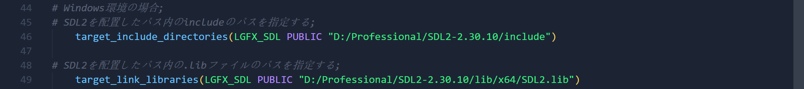
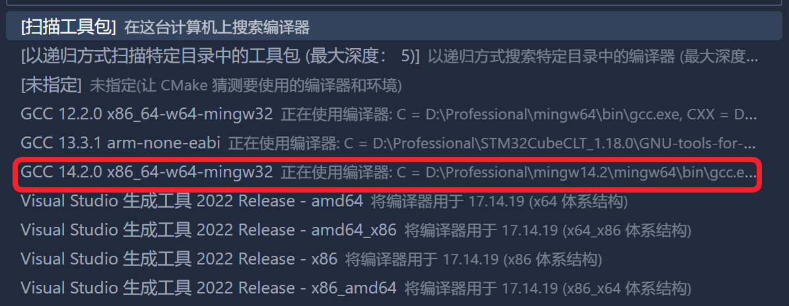

# lgfx_simulator_with_mc_and_smoothui

taste the mooncake and smoothui easily for newbie.

# how to use

base env：windows 11

1. download packs.
    - install [cmake](https://github.com/Kitware/CMake/releases/download/v3.26.0/cmake-3.26.0-windows-x86_64.msi) version 3.14.0 or later. I use cmake 3.26.0.
    - install [SDL2](https://github.com/libsdl-org/SDL/releases/download/release-2.30.10/SDL2-devel-2.30.10-VC.zip) version 2.30.10.
    - install [mingw](https://github.com/niXman/mingw-builds-binaries/releases/download/14.2.0-rt_v12-rev2/x86_64-14.2.0-release-win32-seh-msvcrt-rt_v12-rev2.7z) version 14.2.0.

2. unzip SDL2 and mingw to your own path.

3. add cmake path and mingw path to your environment variable.

4. clone this repo.

~~~shell
git clone https://github.com/Akuma55532/lgfx_simulator_with_mc_and_smoothui.git
~~~

5. change yor own SDL path in CMakeLists.txt.

6. choose your mingw compiler in cmake gui.（installed cmake tools vscode plugin）

7. build and run.